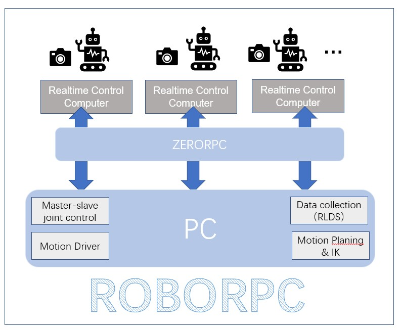

# ROBORPC
Roborpc is a Python package that allows you to communicate with the sim robots and real robots using RPC.




## Installation

You can install the package using pip

```bash
conda create -n roborpc python=3.8
conda activate roborpc
pip install -r requirements.txt
pip install -e .

pip install torch==1.12.1+cu113 torchvision==0.13.1+cu113 --extra-index-url https://download.pytorch.org/whl/cu113
git clone https://github.com/NVlabs/curobo.git
sudo apt install git-lfs
pip install -e . --no-build-isolation


git clone https://github.com/ARISE-Initiative/robosuite.git
cd robosuite
pip install -r requirements.txt
pip install -e .


```

# Usage

### Robots Data Collection 🧹

-  Hardware preparation related to [`hardware_preparation.md`](https://github.com/WangYong-999/roborpc/blob/main/docs/hardware_preparation.md)
-  Software preparation related to [`software_preparation.md`](https://github.com/WangYong-999/roborpc/blob/main/docs/software_preparation.md)
-  Robots data collection related to [`data_collection.md`](https://github.com/WangYong-999/roborpc/blob/main/docs/data_collection.md)
- 
### Robots Evaluation 🚀
```python
import subprocess

from roborpc.robot_env import RobotEnv

if __name__ == '__main__':
    try:
        controller_pid = subprocess.Popen(
            'bash -c "python /home/jz08/code_repo/roborpc/roborpc/controllers/multi_controllers.py"',
            shell=True)
        robot_pid = subprocess.Popen(
            'bash -c "python /home/jz08/code_repo/roborpc/roborpc/robots/multi_robots.py"',
            shell=True)
        camera_pid = subprocess.Popen(
            'bash -c "python /home/jz08/code_repo/roborpc/roborpc/cameras/multi_cameras.py"',
            shell=True)
        robot_env = RobotEnv()
        controller = robot_env.controllers
        while True:
            try:
                obs = robot_env.get_observation()
                action = controller.forward(obs)
                print(action)
                # robot_env.step(action)
            except KeyboardInterrupt:
                controller_pid = subprocess.run(["pgrep", "-f", "multi_controllers"], capture_output=True)
                robot_pid = subprocess.run(["pgrep", "-f", "multi_robots"], capture_output=True)
                camera_pid = subprocess.run(["pgrep", "-f", "multi_cameras"], capture_output=True)
                subprocess.run(["kill", "-9", *(controller_pid.stdout.decode('utf-8').strip().rstrip().split('\n'))])
                subprocess.run(["kill", "-9", *(robot_pid.stdout.decode('utf-8').strip().rstrip().split('\n'))])
                subprocess.run(["kill", "-9", *(camera_pid.stdout.decode('utf-8').strip().rstrip().split('\n'))])
                break
    except Exception as e:
        print(e)
        controller_pid = subprocess.run(["pgrep", "-f", "multi_controllers"], capture_output=True)
        robot_pid = subprocess.run(["pgrep", "-f", "multi_robots"], capture_output=True)
        camera_pid = subprocess.run(["pgrep", "-f", "multi_cameras"], capture_output=True)
        subprocess.run(["kill", "-9", *(controller_pid.stdout.decode('utf-8').strip().rstrip().split('\n'))])
        subprocess.run(["kill", "-9", *(robot_pid.stdout.decode('utf-8').strip().rstrip().split('\n'))])
        subprocess.run(["kill", "-9", *(camera_pid.stdout.decode('utf-8').strip().rstrip().split('\n'))])
```


# License
MIT
